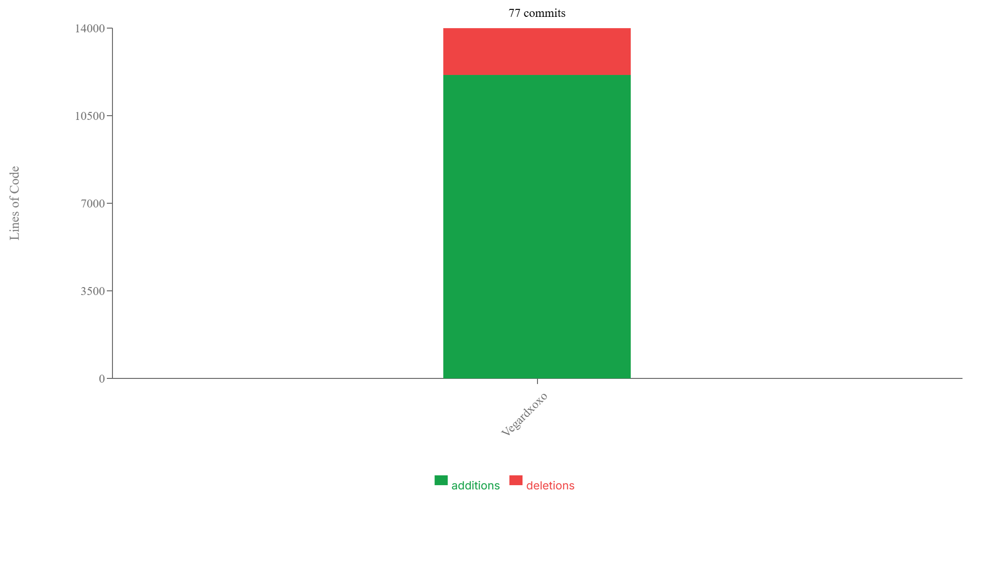

# Repository Analysis - Vegardxoxo/nextjs-dashboard

## Summary

This report provides an analysis of the repository Vegardxoxo/nextjs-dashboard, focusing on commit quality, test coverage, and potential sensitive files.

## Commit Frequency Analysis

### Author Contribution Statistics

| Author | Email | Commits | Percentage |
|--------|-------|---------|------------|
| Vegardxoxo | vnhenrik@stud.ntnu.no | 77 | 100.0% |

**Total Commits**: 77

### Recommendations

Maintain a consistent commit frequency to ensure steady progress and easier code reviews. Aim for smaller, more frequent commits rather than large, infrequent ones to reduce merge conflicts and improve collaboration.

## Commit Contributions Analysis

### Contributors

| Contributor | Email | Additions | Deletions | Total Lines |
|-------------|-------|-----------|-----------|-------------|
| Vegardxoxo | vnhenrik@stud.ntnu.no | 12128 | 1870 | 13998 |

### Recommendations

The distribution of contributions shows how work is shared across the team. Ensure that knowledge isn't siloed with a few contributors and promote collaborative practices like pair programming and code reviews to spread expertise.

## Test Coverage Analysis

### Overall Coverage Metrics

| Metric | Coverage |
|--------|----------|
| Overall | 82.5% |
| Statements | 91.7% |
| Branches | 80.0% |
| Functions | 66.7% |
| Lines | 91.7% |

### Files with Low Coverage

| File | Statements | Branches | Functions |
|------|------------|----------|----------|
| `/home/runner/work/nextjs-dashboard/nextjs-dashboard/app/dashboard/customers/page.tsx` | 83.75% | 66.66% | 50% |

### Recommendations

Excellent test coverage! Keep up the good work maintaining high test coverage across the codebase.

## Sensitive Files Analysis

Review the identified sensitive files and ensure they are properly handled. Consider adding them to .gitignore if they contain sensitive information.

### Sensitive Files (2)

These files may contain credentials, tokens, or other secrets and should be handled with care:

| File Path |
|-----------|
| `.env` |
| `things.db` |

### Warning Files (5)

These files may contain temporary data or system-specific configurations:

| File Path |
|-----------|
| `.idea/.gitignore` |
| `.idea/inspectionProfiles/Project_Default.xml` |
| `.idea/modules.xml` |
| `.idea/nextjs-dashboard.iml` |
| `.idea/vcs.xml` |

---
Generated on 29.4.2025 by GitTrack