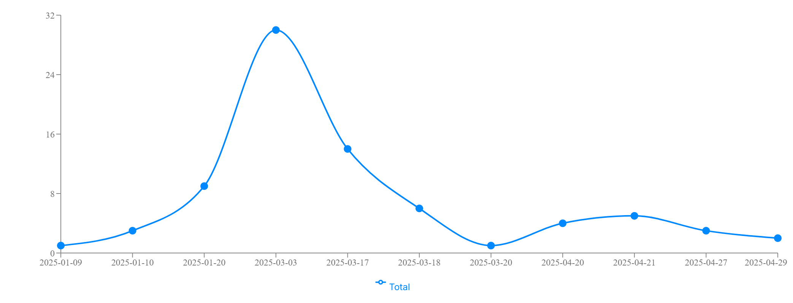

# Repository Analysis - Vegardxoxo/nextjs-dashboard

## Summary

This report provides an analysis of the repository Vegardxoxo/nextjs-dashboard, focusing on commit quality, test coverage, and potential sensitive files.

## Commit Frequency Analysis

### Author Contribution Statistics

| Author | Email | Commits | Percentage |
|--------|-------|---------|------------|
| Vegard Nikolai Dahlberg Henriksen | vnhenrik@stud.ntnu.no | 78 | 100.0% |

**Total Commits**: 78

### Recommendations

Maintain a consistent commit frequency to ensure steady progress and easier code reviews. Aim for smaller, more frequent commits rather than large, infrequent ones to reduce merge conflicts and improve collaboration.

## Sensitive Files Analysis

Do not upload .env

### Sensitive Files (3)

These files may contain credentials, tokens, or other secrets and should be handled with care:

| File Path |
|-----------|
| `.env` |
| `passwords.txt` |
| `things.db` |

### Warning Files (6)

These files may contain temporary data or system-specific configurations:

| File Path |
|-----------|
| `.idea/.gitignore` |
| `.idea/inspectionProfiles/Project_Default.xml` |
| `.idea/modules.xml` |
| `.idea/nextjs-dashboard.iml` |
| `.idea/vcs.xml` |
| `node_modules` |

---
Generated on 9.5.2025 by GitTrack