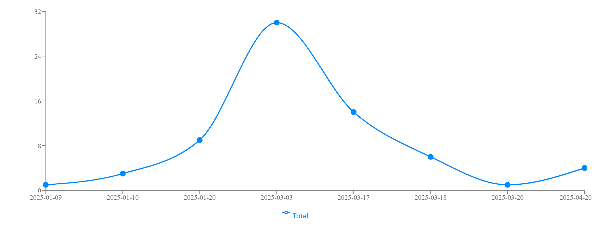
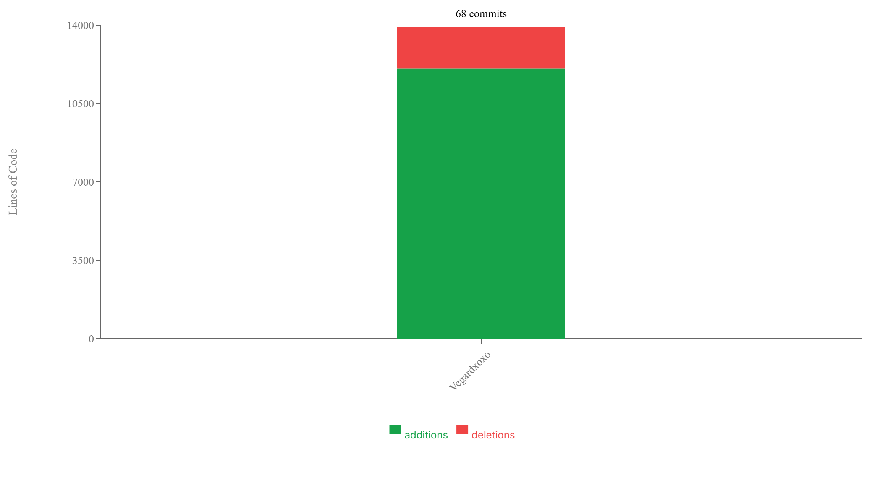

# Repository Analysis - Vegardxoxo/nextjs-dashboard

## Summary

This report provides an analysis of the repository Vegardxoxo/nextjs-dashboard, focusing on commit quality, test coverage, and potential sensitive files.

## Commit Quality Analysis

- **Total Commits Analyzed**: 7
- **Overall Quality Score**: 6.0/10
- **Quality Status**: Moderate

### Commit Categories Breakdown

- **Excellent**: 2 commits (28.6%)
- **Good**: 3 commits (42.9%)
- **Needs Improvement**: 2 commits (28.6%)

### Commit Message Analysis

| Commit Message | Classification | Justification |
|----------------|----------------|---------------|
| Set up project structure and added initial configuration | Excellent | Clear and descriptive message reflecting the changes made |
| Implemented user authentication feature | Good | Descriptive but could include more specifics about the implementation |
| Fixed issue with login validation | Needs Improvement | Message lacks detail about the specific problem and solution |
| Refactored API calls for better performance | Good | Message is clear but could provide a more detailed context |
| Added detailed contributor guidelines in README | Excellent | Very clear and helpful for future collaborators |
| Optimized database queries for faster response times | Good | Message is descriptive but could specify what optimizations were made |
| Fixed typo in error messages displayed to users | Needs Improvement | Message is accurate but too trivial for a single commit |

### Recommendations

Your commit messages are adequate but could be improved. Try to be more descriptive about what changes were made and why.

## Commit Frequency Analysis

### Author Contribution Statistics

| Author | Email | Commits | Percentage |
|--------|-------|---------|------------|
| Vegardxoxo | vnhenrik@stud.ntnu.no | 68 | 100.0% |

**Total Commits**: 68

### Recommendations

Maintain a consistent commit frequency to ensure steady progress and easier code reviews. Aim for smaller, more frequent commits rather than large, infrequent ones to reduce merge conflicts and improve collaboration.

## Commit Contributions Analysis

### Contributors

| Contributor | Email | Additions | Deletions | Total Lines |
|-------------|-------|-----------|-----------|-------------|
| Vegardxoxo | vnhenrik@stud.ntnu.no | 12064 | 1847 | 13911 |

### Recommendations

The distribution of contributions shows how work is shared across the team. Ensure that knowledge isn't siloed with a few contributors and promote collaborative practices like pair programming and code reviews to spread expertise.

## Branch-Issue Connection Analysis

- **Total Branches**: 28
- **Branches Linked to Issues**: 0 (0%)
- **Unlinked Branches**: 28 (100%)

### Recommendations

Improve branch naming conventions to clearly link branches to issues. Consider creating a development branch directly from the issue to ensure linkage.

## Test Coverage Analysis

### Overall Coverage Metrics

| Metric | Coverage |
|--------|----------|
| Overall | 82.5% |
| Statements | 91.7% |
| Branches | 80.0% |
| Functions | 66.7% |
| Lines | 91.7% |

### Files with Low Coverage

| File | Statements | Branches | Functions |
|------|------------|----------|----------|
| `/home/runner/work/nextjs-dashboard/nextjs-dashboard/app/dashboard/customers/page.tsx` | 83.75% | 66.66% | 50% |

### Recommendations

Excellent test coverage! Keep up the good work maintaining high test coverage across the codebase.

## Direct Commits to the Main Branch

68 commits made directly to the main branch without going through pull requests.

### Contributors with Direct Commits

| Contributor | Number of Direct Commits |
|-------------|--------------------------|
| Vegardxoxo | 60 |
| Vegard Nikolai Dahlberg Henriksen | 8 |

### Recommendations

Avoid committing directly to the main branch. Use feature branches and pull requests instead to ensure code quality and facilitate code reviews.

## Sensitive Files Analysis

Review the identified sensitive files and ensure they are properly handled. Consider adding them to .gitignore if they contain sensitive information.

### Warning Files (5)

These files may contain temporary data or system-specific configurations:

| File Path |
|-----------|
| `.idea/.gitignore` |
| `.idea/inspectionProfiles/Project_Default.xml` |
| `.idea/modules.xml` |
| `.idea/nextjs-dashboard.iml` |
| `.idea/vcs.xml` |

---
Generated on 21.4.2025 by Git Workflow Analysis Tool