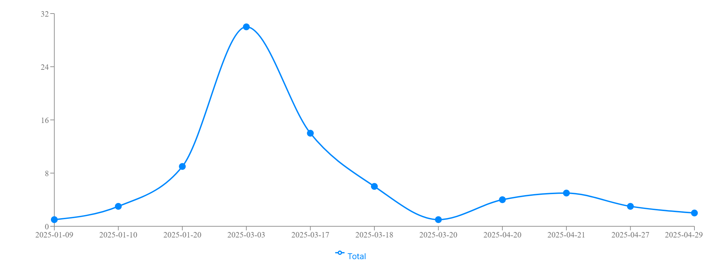
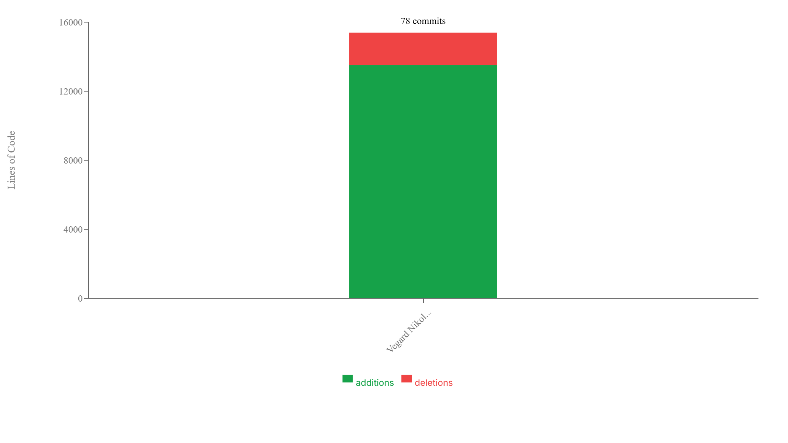

# Repository Analysis - Vegardxoxo/nextjs-dashboard

## Summary

This report provides an analysis of the repository Vegardxoxo/nextjs-dashboard, focusing on commit quality, test coverage, and potential sensitive files.

## Commit Quality Analysis

### Commit Categories Breakdown

- **Excellent**: 2 commits (22.2%)
- **Good**: 3 commits (33.3%)
- **Needs Improvement**: 4 commits (44.4%)

### Commit Message Analysis

| Commit Message | Classification | Justification |
|----------------|----------------|---------------|
| Set up project structure and added initial configuration | Good | Clearly states what was done but does not explain the motivation or give specifics about the configuration. |
| Implemented user authentication feature | Good | Describes the main change (adding authentication), yet lacks detail on scope, methods, or rationale. |
| Fixed issue with login validation | Good | Indicates a bug fix and its context (login validation) but omits the underlying cause or approach taken. |
| Refactored API calls for better performance. Resolves #23 | Excellent | Specifies what was refactored, why (better performance), and links to the related issue. |
| Added detailed contributor guidelines in README | Excellent | Explains what changed (README guidelines) and implicitly why (to guide contributors), providing sufficient clarity and context. |
| changes | Needs Improvement | Extremely vague; offers no insight into what was changed or why. |
| fix stuff | Needs Improvement | Provides neither detail about the problem nor the fix; lacks context entirely. |
| progress | Needs Improvement | Generic and uninformative; does not describe what progress was made. |
| FINALLY WORKING | Needs Improvement | Emotional statement without technical detail; fails to explain what is working or how. |

### Recommendations

Ganske dårlige commit meldinger. 

## Commit Frequency Analysis

### Author Contribution Statistics

| Author | Email | Commits | Percentage |
|--------|-------|---------|------------|
| Vegard Nikolai Dahlberg Henriksen | vnhenrik@stud.ntnu.no | 78 | 100.0% |

**Total Commits**: 78

### Recommendations

Maintain a consistent commit frequency to ensure steady progress and easier code reviews. Aim for smaller, more frequent commits rather than large, infrequent ones to reduce merge conflicts and improve collaboration.

## Commit Contributions Analysis

### Contributors

| Contributor | Email | Additions | Deletions | Total Lines |
|-------------|-------|-----------|-----------|-------------|
| Vegard Nikolai Dahlberg Henriksen | vnhenrik@stud.ntnu.no | 13517 | 1872 | 15389 |

### Recommendations

The distribution of contributions shows how work is shared across the team. Ensure that knowledge isn't siloed with a few contributors and promote collaborative practices like pair programming and code reviews to spread expertise.

## Pull Requests Analysis
    

### Pull Request Statistics

- **Total Pull Requests**: 3
- **PRs with Review**: 0 (0%)
- **PRs without Review**: 3 (100%)
- **Average Time to Merge**: 0.03 hours
- **Average Comments per PR**: 0.33

### Pull Request Activity by User

| User | Pull Requests | Reviews | Reviews % | Comments | Comments % |
|------|--------------|---------|-----------|----------|------------|
| Vegardxoxo | 3 | 0 | 0% | 0 | 0% |

### Recommendations

Encourage team members to review each other's pull requests to improve code quality and knowledge sharing. Consider implementing a policy where PRs require at least one review before merging.

## Branch-Issue Connection Analysis

- **Total Branches**: 29
- **Branches Linked to Issues**: 0 (0%)
- **Unlinked Branches**: 29 (100%)

### Recommendations

Improve branch naming conventions to clearly link branches to issues. Consider creating a development branch directly from the issue to ensure linkage.

## Test Coverage Analysis

### Overall Coverage Metrics

| Metric | Coverage |
|--------|----------|
| Overall | 82.5% |
| Statements | 91.7% |
| Branches | 80.0% |
| Functions | 66.7% |
| Lines | 91.7% |

### Files with Low Coverage

| File | Statements | Branches | Functions |
|------|------------|----------|----------|
| `/home/runner/work/nextjs-dashboard/nextjs-dashboard/app/dashboard/customers/page.tsx` | 83.75% | 66.66% | 50% |

### Recommendations

Helt ok test dekningsgrad.

## Direct Commits to the Main Branch

76 commits made directly to the main branch without going through pull requests.

### Contributors with Direct Commits

| Contributor | Number of Direct Commits |
|-------------|--------------------------|
| Vegardxoxo | 65 |
| Vegard Nikolai Dahlberg Henriksen | 11 |

### Recommendations

Avoid committing directly to the main branch. Use feature branches and pull requests instead to ensure code quality and facilitate code reviews.

## Sensitive Files Analysis

Review the identified sensitive files and ensure they are properly handled. Consider adding them to .gitignore if they contain sensitive information.

### Sensitive Files (3)

These files may contain credentials, tokens, or other secrets and should be handled with care:

| File Path |
|-----------|
| `.env` |
| `passwords.txt` |
| `things.db` |

### Warning Files (6)

These files may contain temporary data or system-specific configurations:

| File Path |
|-----------|
| `.idea/.gitignore` |
| `.idea/inspectionProfiles/Project_Default.xml` |
| `.idea/modules.xml` |
| `.idea/nextjs-dashboard.iml` |
| `.idea/vcs.xml` |
| `node_modules` |

## Additional Notes

Ikke commit .env lol

---
Generated on 3.5.2025 by GitTrack